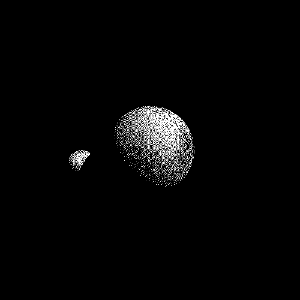

satcaster
=========



```sh
$ rustup toolchain install nightly
$ rustup target add wasm32-unknown-unknown --toolchain nightly
$ cargo +nightly install cargo-web
$ cargo +nightly web start --target-webasm --release
```
