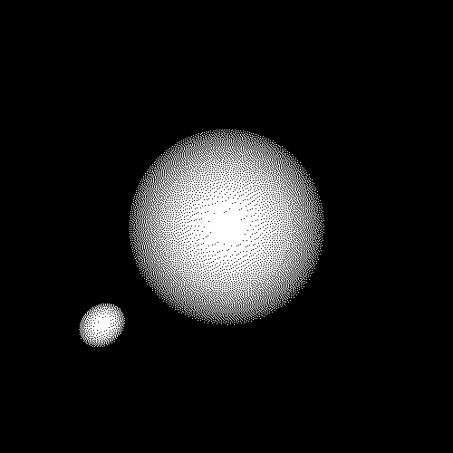

satcaster
=========



## Building

```sh
mkdir build
cd build
cmake ..
cd ..
make -C build
```

## Text format

Scenes are specified in a text file with the following format:

```
width height
(cameraPosition) (cameraDirection) fov

(sphereCenter) sphereRadius randomSeed
...
```
